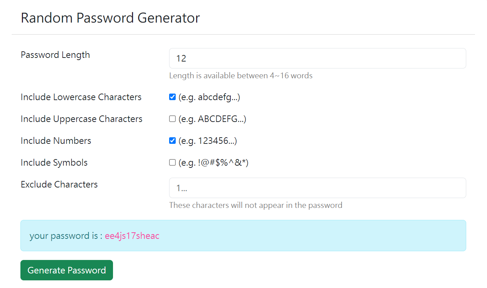

# Password Generator

Password Generator is a simple website for generating passwords.

## Development Environment
- Node.js v20.10.0

## Main Features
- version 1.0.0
1. Generate random passwords between 4 to 16 characters.
2. Choose character types for the password, including uppercase letters, lowercase letters, numbers, and symbols.
3. Exclude specific characters from the password.

## screenshot


## Tools Used

- express 4.19.2
- express-handlebars 7.1.2
- Bootstrap 5.3.3

## Installation and Usage

### Clone the Repository

```sh
git clone https://github.com/ryo20021108/password-generator.git
cd password-generator
```

### Install Dependencies

```sh
npm install
```

### Start the Application

```sh
npm run start
```

Open http://localhost:3000 in your browser to use the password generator.
If it runs successfully, the console will display : express server is running on http://localhost:3000
